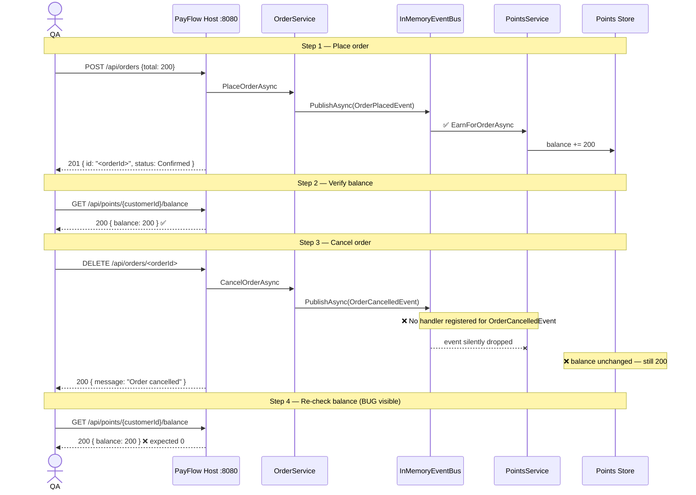
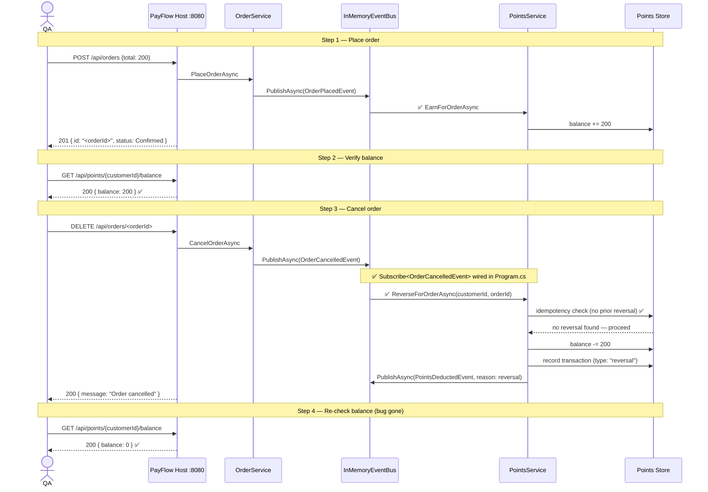

# QA Handoff — Bug #2: Cancelled orders don't reverse points

## Setup

```bash
# Start the app (pick one)
docker compose up --build
# or
cd src/PayFlow.Host && dotnet run
```

All endpoints on **http://localhost:8080**.  
Use `customerId = aaaaaaaa-aaaa-aaaa-aaaa-aaaaaaaaaaaa` throughout.

---

## Repro steps

```bash
# Step 1 — Place an order (save the returned id as <orderId>)
curl -s -X POST http://localhost:8080/api/orders \
  -H "Content-Type: application/json" \
  -d '{"customerId":"aaaaaaaa-aaaa-aaaa-aaaa-aaaaaaaaaaaa","total":200}' | jq .

# Step 2 — Confirm points were earned
curl -s http://localhost:8080/api/points/aaaaaaaa-aaaa-aaaa-aaaa-aaaaaaaaaaaa/balance | jq .
# Expected: { "balance": 200 }

# Step 3 — Cancel the order
curl -s -X DELETE http://localhost:8080/api/orders/<orderId> | jq .
# Expected: { "message": "Order cancelled" }

# Step 4 — Re-check balance   ← BUG visible here (before fix)
curl -s http://localhost:8080/api/points/aaaaaaaa-aaaa-aaaa-aaaa-aaaaaaaaaaaa/balance | jq .
# BUGGY:  { "balance": 200 }   ← points NOT reversed
# FIXED:  { "balance": 0 }     ← points correctly reversed
```

---

## Before fix — buggy flow



**Observed:** `{ "balance": 200 }` after cancellation.  
**Expected:** `{ "balance": 0 }`.

---

## After fix — correct flow



**Observed after fix:** `{ "balance": 0 }` — points correctly reversed.

---

## What changed

| File | Change |
|---|---|
| [src/PayFlow.Host/Program.cs](../../src/PayFlow.Host/Program.cs) | Added `Subscribe<OrderCancelledEvent>` using `IServiceScopeFactory` (avoids captive-dependency bug) |
| [PayFlow.PointsApi/Program.cs](../../PayFlow.PointsApi/Program.cs) | Same subscription wired for the standalone host |
| [tests/…/PointsServiceTests.cs](../../tests/PayFlow.Unit.Tests/Services/PointsServiceTests.cs) | Replaced stale `ThrowsNotImplementedException` placeholder with 4 reversal tests (balance, idempotency, no-earn guard, transaction record) |
