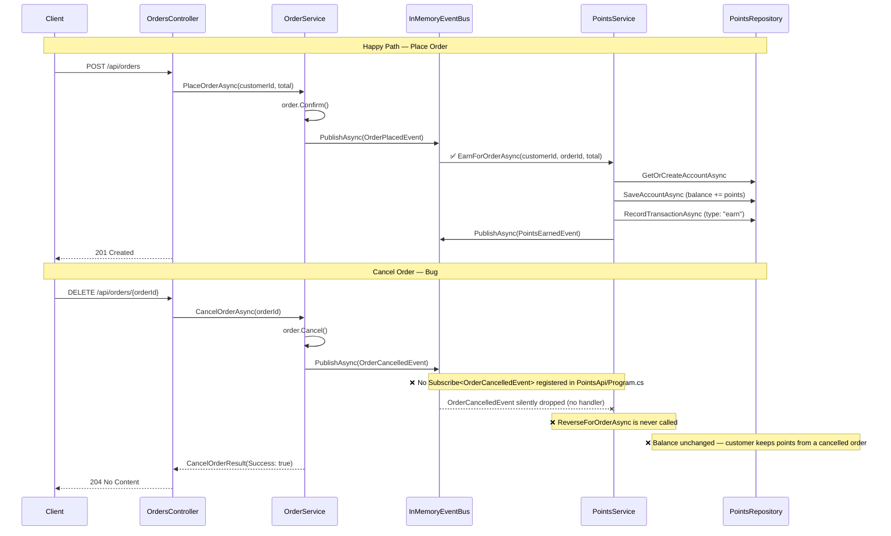

# Bug #2 — Sequence Diagram: Order Cancellation & Points Reversal

## Gap summary

| Step | Status | Location |
|---|---|---|
| `OrderPlacedEvent` → `EarnForOrderAsync` subscription | ✅ wired | `src/PayFlow.Host/Program.cs` or `src/PayFlow.OrdersApi/Program.cs` |
| `OrderCancelledEvent` published on cancellation | ✅ implemented | `src/PayFlow.OrdersApi/Services/OrderService.cs` |
| `OrderCancelledEvent` → `ReverseForOrderAsync` subscription | ❌ **missing** | `PayFlow.PointsApi/Program.cs` |
| `ReverseForOrderAsync` implementation | ✅ implemented | `PayFlow.PointsApi/Services/PointsService.cs` |
